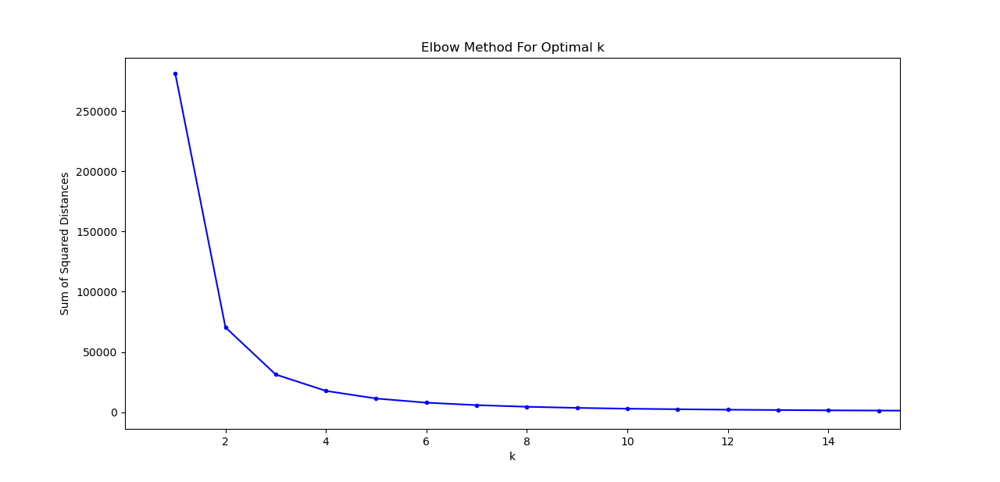

# ACM Research Coding Challenge (Fall 2020)

## No Collaboration Policy

**You may not collaborate with anyone on this challenge.** You _are_ allowed to use Internet documentation. If you _do_ use existing code (either from Github, Stack Overflow, or other sources), **please cite your sources in the README**.

## Submission Procedure

Please follow the below instructions on how to submit your answers.

1. Create a **public** fork of this repo and name it `ACM-Research-Coding-Challenge`. To fork this repo, click the button on the top right and click the "Fork" button.
2. Clone the fork of the repo to your computer using . `git clone [the URL of your clone]`. You may need to install Git for this (Google it).
3. Complete the Challenge based on the instructions below.
4. Email the link of your repo to research@acmutd.co with the same email you used to submit your application. Be sure to include your name in the email.

## Question One

 
Given the following dataset in `ClusterPlot.csv`, determine the number of clusters by using any clustering algorithm. **You're allowed to use any Python library you want to implement this**, just document which ones you used in this README file. Try to complete this as soon as possible.

Regardless if you can or cannot answer the question, provide a short explanation of how you got your solution or how you think it can be solved in your README.md file.

## Solution
I used the k-means clustering algorithm and "elbow method" to determine the optimal number of clusters. The k-means algorithm searches for a pre-determined number of clusters within a dataset by assuming that the cluster center is the arithmetic mean of all points belonging to the cluster and that each point is closer to its own cluster center than to other cluster centers. The first thing I did was import the necessary Python libraries: CSV for reading the ClusterPlot.csv file, Pandas for reading the data from the csv file into a DataFrame object, KMeans for actually implementing the k-means algorithm, and Matplotlib for visualizing the elbow method. Then I used Pandas to read the csv file into a DataFrame object named 'data'. Then for each possible _k_ (number of centroids and clusters), which ranges from 1 to the number of samples, I used KMeans to determine _k_ centroids and calculate the interia, which is the sum of squared distances of samples to the nearest cluster centroid. I appended each interia value for each _k_ to a list. Then I used Matplotlib to plot each possible _k_ value to its corresponding intertia. Then I used the elbow method since the shape of the resulting plot resembled an arm. In order to determine the optimal number of clusters, I selected the value of k at the “elbow”: the point after which the inertia starts decreasing in a linear fashion. I determined the optimal number of clusters is **3**. Below is a zoomed in version of the plot to demonstrate the elbow method and picture of cluster plot if _k_ is 3 represented by different colors for each cluster.

 
## Python Libraries Used
* CSV
* Pandas
* KMeans
* Matplotlib

## Sources
* [How to determine the optimal number of clusters for k-means clustering](https://blog.cambridgespark.com/how-to-determine-the-optimal-number-of-clusters-for-k-means-clustering-14f27070048f)
* [Elbow Method for optimal value of k in KMeans](https://www.geeksforgeeks.org/elbow-method-for-optimal-value-of-k-in-kmeans/)
* [kmeans scatter plot: plot different colors per cluster
](https://stackoverflow.com/questions/28227340/kmeans-scatter-plot-plot-different-colors-per-cluster)
